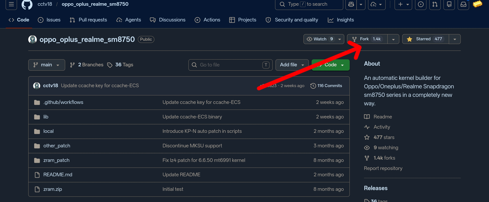
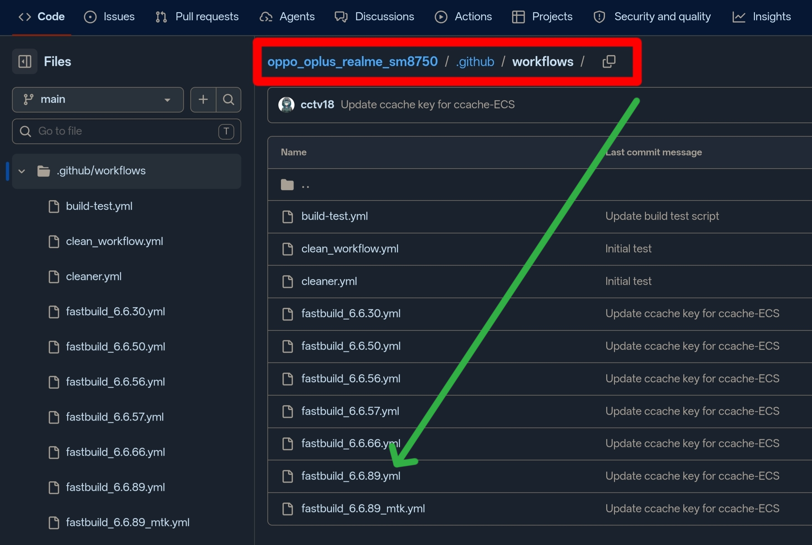
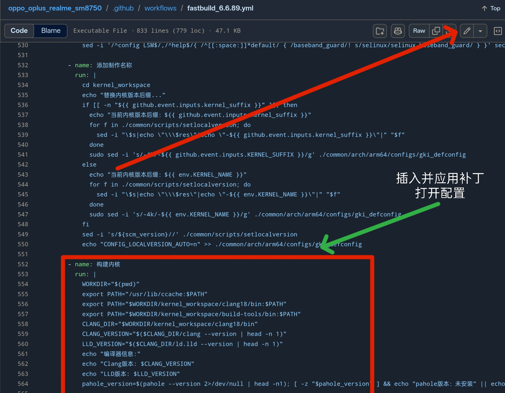

# OKI内核 云端编译指南 
- 适用设备：一加，OPPO，真我
- 适用内核版本：6.1-6.12
>[!TIP]
>
>本教程仅适用于编译支持 **Droidspaces** 和 **NTsync** 的内核
>
>请严格按照教学，以确保内核编译不出错并完美运行


## 前提准备：
- 知道 [Droidspaces项目](https://github.com/ravindu644/Droidspaces-OSS) 是干什么的
- 一台解了 Bootloader 锁的设备，设备建议高通骁龙(否则没有GPU加速)
- 查看 `设置－>关于手机->版本信息->内核版本` 是否为 `6.1.xxx~6.12.xxx` 内核版本
- 备份好你的手机对应的原 `Boot` 文件
- 系统必须是 `ColorOS` `OxygenOS`

## 配置
### 1.查看本项目主页的表格的OKI系列的内核版本状态是否有 ✅完美运行
- 如果你的机型正好是测试通过的机型，那么恭喜你，你只要严格按照本教程来，100%获得完美支持DroidSpaces的内核
- 你的机型如果不是测试通过的机型，那也不用慌张，打上内核版本相同的补丁，大概率也可以获得完美支持DroidSpaces的内核
### 2.Fork [cctv18](https://github.com/cctv18) 的内核项目
- OKI内核6.1系列 https://github.com/cctv18/oppo_oplus_realme_sm8650
- OKI内核6.6系列 https://github.com/cctv18/oppo_oplus_realme_sm8750
- OKI内核6.12系列 https://github.com/cctv18/oppo_oplus_realme_sm8850

例子:若你的设备是`一加ace5Pro`，发现你的内核版本为`6.6.xxx`:



>[!WARNING]
>请选择你对应的手机内核版本的项目，一旦选错，100%不开机
### 3.添加对 `DroidSpaces` 的支持
1. 先回到本项目中,查看表格中的 `说明` ,选择对应Droidspaces版本号的补丁(建议选择 ≥ v5.9.5 的) 
2. 进入 <ins>/OKI/对应版本号</ins> 文件夹，复制补丁的`Raw`链接
3. 打开你 `Fork项目` 里的 <ins>/.github/workflows</ins> 文件夹，挑选对应版本号的 `yml文件`
4. 编辑文件，在 `构建内核` 流程前，插入并应用补丁开启配置

例子:若你的设备是`一加ace5Pro`，发现你的内核版本为`6.6.89`:

第三步



第四步,以下文本为事例文本

```yml
      - name: 注入DroidSpaces内核配置
        run: |
            cd kernel_workspace/common
            wget https://raw.githubusercontent.com/Goldzxcbug/Droidspaces_Kernel_patch/refs/heads/main/OKI/6.6/Kernel_6.6.patch
            patch -p1 < 'Kernel_6.6.patch'            
            cd ../
            # 修复 [✗] PID namespace 和 [✗] IPC namespace
              echo "CONFIG_SYSVIPC=y" >> ./common/arch/arm64/configs/gki_defconfig
              echo "CONFIG_POSIX_MQUEUE=y" >> ./common/arch/arm64/configs/gki_defconfig
              echo "CONFIG_NAMESPACES=y" >> ./common/arch/arm64/configs/gki_defconfig
              echo "CONFIG_PID_NS=y" >> ./common/arch/arm64/configs/gki_defconfig
              echo "CONFIG_IPC_NS=y" >> ./common/arch/arm64/configs/gki_defconfig
              
            # 修复 [✗] devtmpfs support
              echo "CONFIG_DEVTMPFS=y" >> ./common/arch/arm64/configs/gki_defconfig
```

### 4.手动触发Actions的对应工作流，等待20min左右的AK3出炉
- 刷入Ak3包，运行 `Droidspaces` 检查，并运行容器，设备长时间运行并不崩溃，则为 ✅完美运行
- 如果卡一屏，开不了机，但是测试通过的机型，可以检查哪一步出错，还是Actions配置选错
- 如果卡一屏，开不了机, 而且是内核版本有通过的机型，但本身不是测试通过的机型，并严格按照本教程来，可以测试`Droidspaces`给出的sysvipc的其他补丁1_2_3,3_4_5,5_6_7
